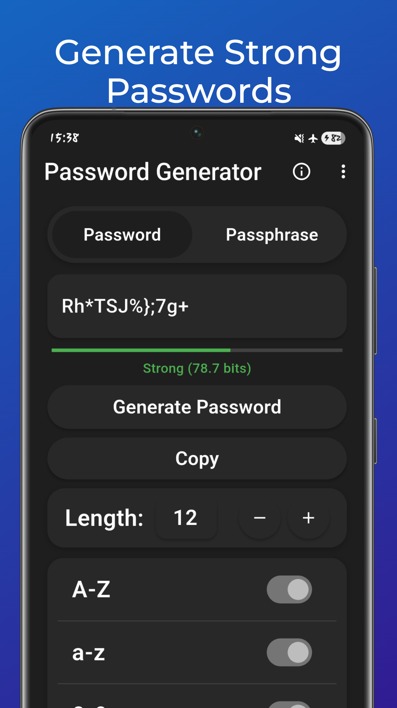

# Password Generator Flutter App

A simple, local, strong and customizable Password Generator built using Flutter.

## Features
- **Customizable Password Length**: Set the desired length for your password.
- **Character Type Selection**: Choose from uppercase, lowercase, numbers, and special characters.
- **Password Strength Indicator**: See a visual representation of your password’s strength.
- **Copy to Clipboard**: One-click password copy.
- **Sleek UI**: Clean design with a user-friendly interface.

## Installation

https://euhfs.onrender.com/pages/download-page/password-generator.html

## License

This project is licensed under the Apache 2.0 License, check the repository for "LICENSE"
