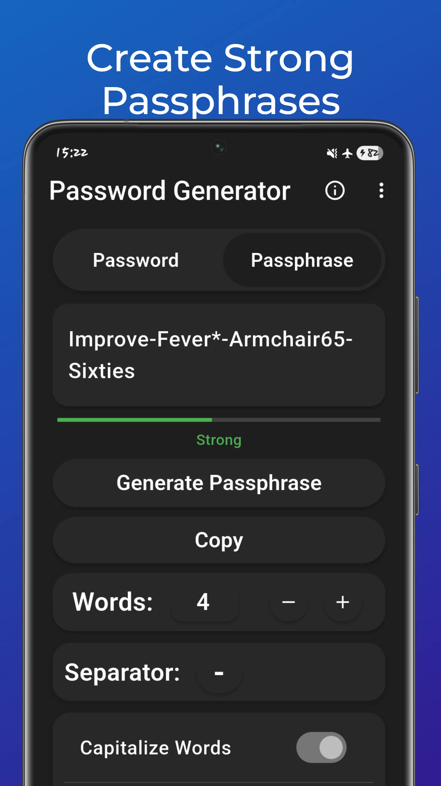
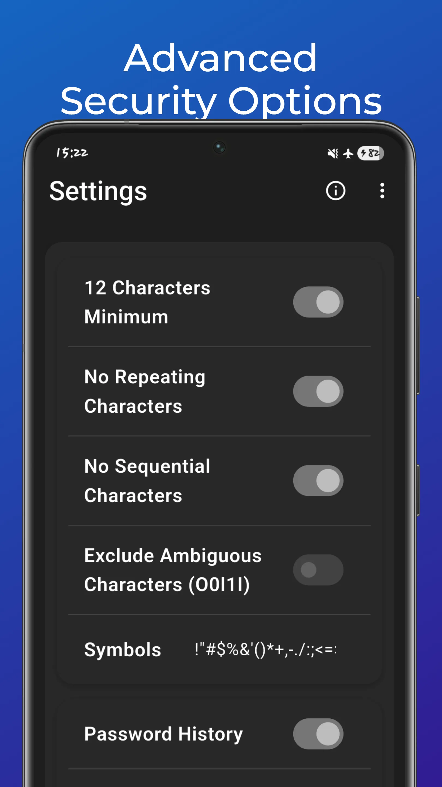
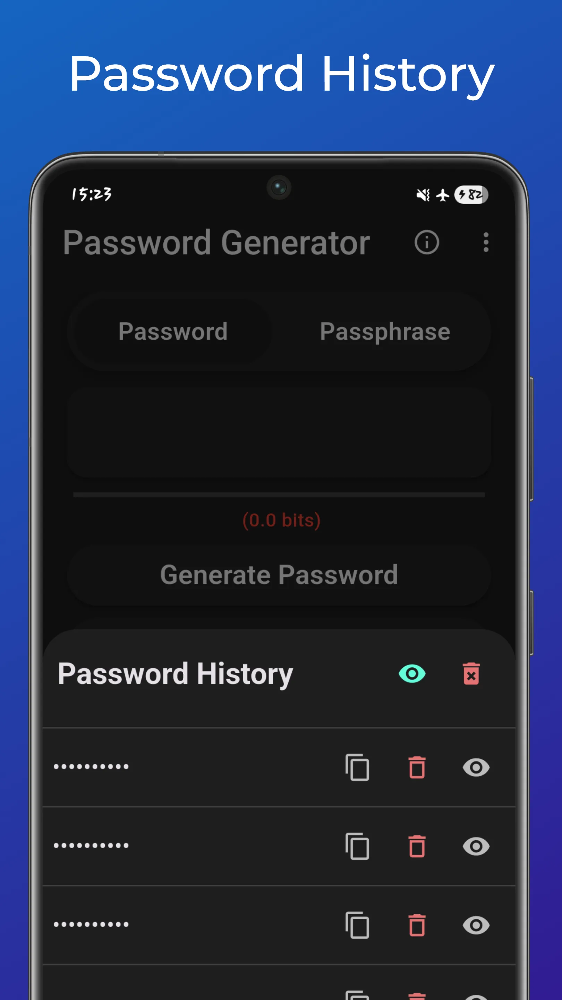
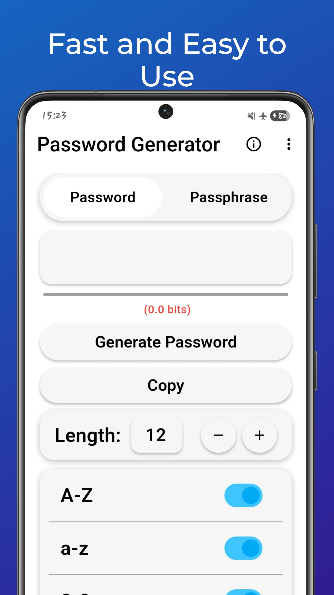

# Password Generator Flutter App

A simple, local, strong, customizable and privacy focused Password Generator built using Flutter.

  
  
  
  
  

## Features
- **Customizable Password Length**: Set the desired length for your password.
- **Passphrase**: Generate Passphrases for stronger, memorable passwords with a lot of customizations.
- **Character Type Selection**: Choose from uppercase, lowercase, numbers, and special characters.
- **Password Strength Indicator**: See a visual representation of your password’s strength.
- **Copy to Clipboard**: One-click password copy.
- **Password History**: Keeps track of your recently generated passwords/passphrases, allowing you to quickly access and reuse them.
- **Sleek UI**: Clean design with a user-friendly interface.

## Installation

# For the Instalation Please visit my website where you can find out which release is available for your device, or check the releases in this repository.
https://euhfs.onrender.com/pages/download-page/password-generator.html

## License

This project is licensed under the Apache 2.0 License, check the repository for the file "LICENSE"
